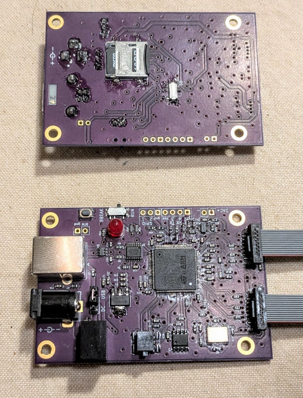

## STM32H7 analog / DSP / controller

General purpose board with 480 MHz STM32 MCU, analog and digital in- outputs, SD card and EEPROM storage, and all the services provided by the [OS library](https://github.com/szoftveres/RF_instruments/tree/main/os). It can be used as a building block / peripheral controller and DSP platform for analog / RF systems.

-->> [Schematics](https://github.com/szoftveres/RF_instruments/tree/main/dsp_stm32H7/schematics.pdf) <<--

 
### Basic specs
 * Analog
   * 3 x 16 bit ADC
   * 1 x 12 bit amplified DAC
 * Digital
   * SPI
   * Auxiliary UART
   * 2 x GPIO
 * Storage:
   * SD card
   * 32 kB EEPROM (programs, data and configuration)
 * Programming: scripting language with BASIC-like syntax
 * Communication interface: USB UART (FT230)
 * Power: +5V via USB, or DC +9 - +18V

