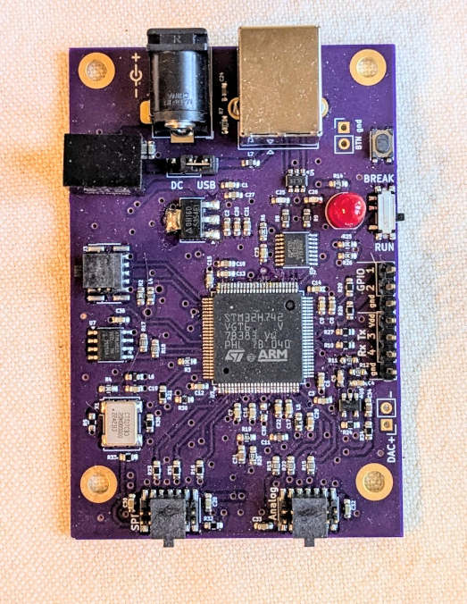
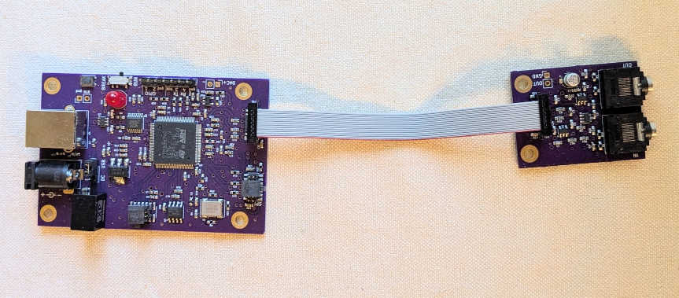

## STM32H7 analog / DSP / controller

-->> [Schematics](https://github.com/szoftveres/RF_instruments/tree/main/dsp_stm32H7/schematics.pdf) <<--

This is a general purpose, high performace microcontroller board, designed to be able to handle various tasks, like main system control and digital signal processing. It's equipeed with a 480 MHz STM32H7 MCU, two 16-bit ADCs, a 12-bit buffered DAC, SPI bus, external UART, EEPROM storage and SD card slot. It can store, load and execute ([BASIC-like](https://github.com/szoftveres/RF_instruments/tree/main/os)) programs, drive peripherals, perform digital signal processing functions, handle file-system access, and communicate with the host via USB-UART (FT230). Other electronics can be connected to it with ribbon cables.

As the main controller of a [vector network analyzer](https://github.com/szoftveres/RF_instruments/tree/main/vna):

With an active (amplified) [audio in- and out interface](https://github.com/szoftveres/RF_instruments/tree/main/dsp_stm32H7/audio.pdf):

