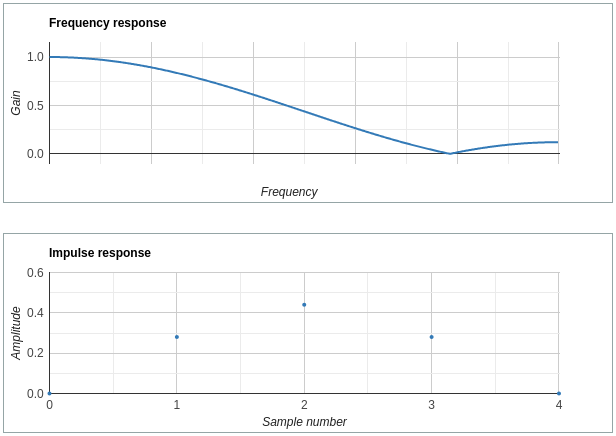
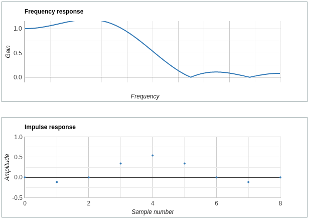
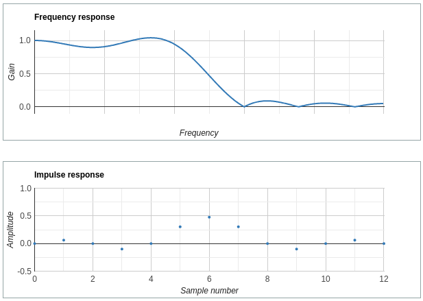
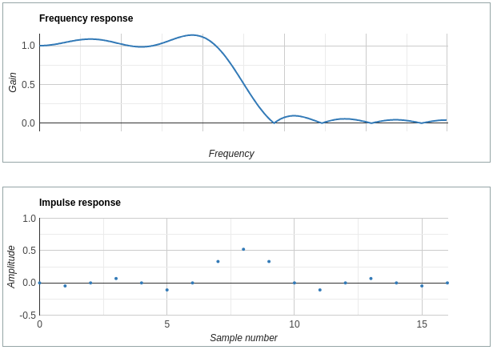
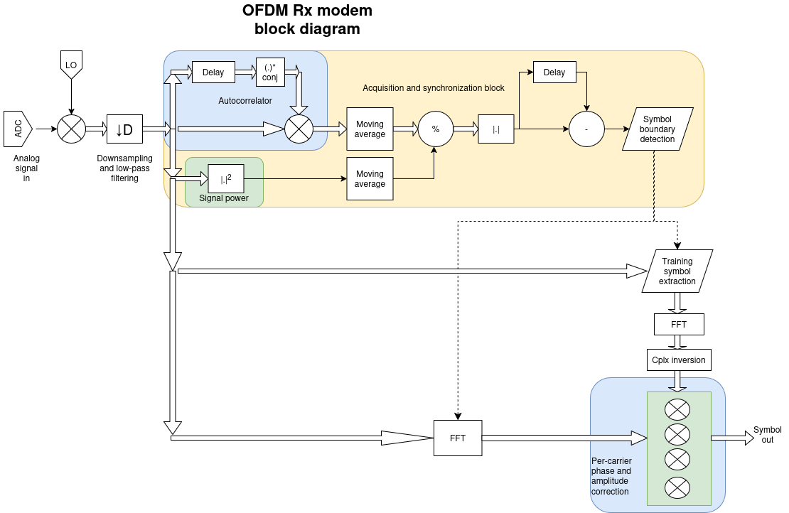
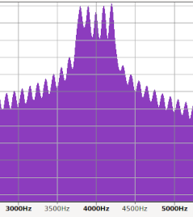

## Generic single-threaded OS library for small embedded systems

This software was made to be used on small single-CPU embedded systems as the main human access- and programming library.

Features:
 * Command line interpreter
   * BASIC-like scripting language, syntax- and expression evaluation (examples [here](https://github.com/szoftveres/RF_instruments/tree/main/siggen))
   * Ability to store, save, load and run programs
   * Ability to add platform- and application specific commands
 * File system abstraction layer that integrates many different filesystems under a single, unified programming interface
   * [minimalist FAT-like filesystem](https://github.com/szoftveres/RF_instruments/blob/main/os/fatsmall_fs.c) for extremely small (e.g. several kB EEPROM) devices.
   * STM32 SD FATFS
   * Unix FS
 * Block device abstraction layer
   * RAM block
   * I2C EEPROM, SD Card, CF Card, Physical disk, etc..
 * Chainable DSP functions
   * DFT, IFT, OFDM modem, Downsampling filter, MS WAV file read/write, etc..


Projects using this library:
 * [6 GHz RF signal generator](https://github.com/szoftveres/RF_instruments/tree/main/siggen)
 * [STM32H7 analog / DSP / controller board](https://github.com/szoftveres/RF_instruments/tree/main/dsp_stm32H7)
 * [Unix runtime / development environment](https://github.com/szoftveres/RF_instruments/tree/main/unix)


## DSP chain

Features:
 * 16 bit unsigned integer samples (0 - 65535)
 * Sample rate: 1 - 65535 Hz
 * Correct sample rate is always communicated down the chain
 * Arbitrary order and number of elements

DSP chain can be realized by using special DSP commands and adding the `->` operator between them (similar to Unix-pipes). After entering a command line, a pseudo-scheduler begins a *job* and waits until all the DSP elements are finished. Sample rate is communicated down the chain so that each DSP chain element is aware of its sample rate. 

The following line implements a simple WAV file player, playing the audio through the DAC (these lines can be part of a program, e.g. implementing a simple playlist):
```
wavfilesrc "fraise.wav" -> dacsnk
```

`wavfilesrc` opens a WAV file and reads its parameters, then then attaches to one end of the *inter-element pipe* (represented by the `->` symbol) and communicates the sample rate, then streams the samples till it reaches the end of the file. The command `dacsnk` attaches to the other end of the *pipe*, reads the sample rate and starts the DAC, and plays the samples on the analog output until there's data to read from the pipe. When `wavfilesrc` finishes and detaches from the *pipe* (*EOF* condition), the reader also detaches from the other side and exits. When all *elements* detached from all pipes and exited, the command line interpreter cleans up all the pipes.

```
wavfilesrc "wav44100.wav" -> df 2 4 -> gain -6 -> wavfilesnk "wav22050.wav"
```
This *job* opens up a WAV file, sends the samples into a downsampling (decimating by a factor of 2) halfband filter, followed by an attenuator element, which in turn sends the samples into a *wav file sink*, an element that creates a WAV file from the samples it received. Hence, this job realizes a WAV file downsampling and amplitude halving function. The filter element calculates and communicates the correct (/2) sample rate downstream so that the WAV file header of the *new* file will contain the correct new sample rate.

```
adc1src 8000 -> wavfilesnk "audio1.wav"
```
Simple 8 kHz sample rate audio recorder. Moving the side-switch to the *Break* position on the [STM32H7 DSP / controller board](https://github.com/szoftveres/RF_instruments/tree/main/dsp_stm32H7) signals the job elements to finish, in this case to stop recording.

### DSP chain elements

#### wavfilesrc "file"
Type: source

Description: Opens up a WAV file and streams its samples out. The samples are always converted to 16-bit mono (e.g. two channels of a stereo file are mixed into one).

#### adc1src [samplerate]
Type: source

Description: Starts ADC1 at the given sample rate (max: 65535) and streams its samples out.

Note: platform-dependent (e.g. [STM32H7 analog / DSP / controller board](https://github.com/szoftveres/RF_instruments/tree/main/dsp_stm32H7) implements it).

#### wavfilesnk "file"
Type: sink

Description: Records incoming samples into a mono 16-bit WAV file. At the end it updates the WAV file header with the up-to-date WAV file information (lenght, sample rate, etc..).

#### dacsnk
Type: sink

Description: Starts the DAC at the received sample rate and plays the samples on the analog output.

Note: platform-dependent (e.g. [STM32H7 analog / DSP / controller board](https://github.com/szoftveres/RF_instruments/tree/main/dsp_stm32H7) implements it).

#### nullsnk
Type: sink

Description: Receives samples, then prints out statistics (sample rate, number of samples, min, max, etc..)

#### sine [samplerate] [frequency] [samples]
Type: source

Description: Generates a full-amplitude pure sine tone for the given number of samples. 

#### noise [samplerate] [samples]
Type: source

Description: Generates full-amplitude noise for the given number of samples. 

#### df [decimation factor] [bf]
Type: through

Description: Downsampling filter with settable parameters and built-in FIR lowpass filter synthesis. The first parameter sets the decimation factor, the second parameter (bf - beautiness factor, min: 1 max: 24) is the number of zero-crossings of the impulse-response of the synthesized FIR filter (i.e. how close it is to an ideal brickwall lowpass filter), and consequently the number of taps required to realize it.

bf = 1:

 * 


bf = 2:

 * 


bf = 3:

 * 


bf = 4:

 * 

#### gain [dB]
Type: through

Description: Attenuates (negative dB) or amplifies (positive dB) at 1 dB granularity.

### OFDM modem

Description: Audio OFDM modem; 4 QPSK carriers + 1 center pilot, 8 bits (1 byte) per symbol, 100 sybols per second. The center carrier frequency can be anywhere within the audio spectrum, both the Rx and Tx sides use down- and upsampling to achieve required (high) center frequency and sufficiently low baseband sample rate for efficient processing (Fourier transform).

#### Receiver

The packet starts with 4 identical preamble symbols, the receiver autocorrelates them and detects the trailing edge of the preamble pulse train and thereby the symbol boundary. This is done by comparing the result of the (power-compensated) autocorrelation and a delayed copy of it; when the first training symbol (which is different from the preambles) arrives, the autocorrelation drops off while its delayed copy is still maintains unity. This condition triggers the end of the preamble and the first training symbol.
After the training symbol (which is used for per-carrier equalization and phase compensation) the rest of the packet follows a conventional packet structure (length, CRC and data, all encoded into OFDM symbols), except that more training symbols are periodically inserted within the packet payload after a certain number of payload symbols. This is to give the receiver an opportunity to track and compensate for any phase shift during (a potentially long) packet transmission, due to frequency mismatch or phase variation.

Rx block diagram:



Spectrum of one packet (pilot centered at 4 kHz):




