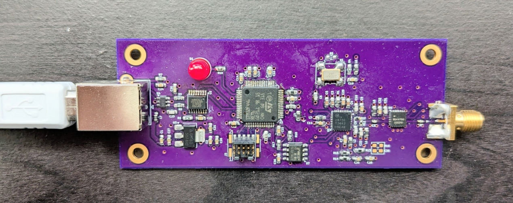
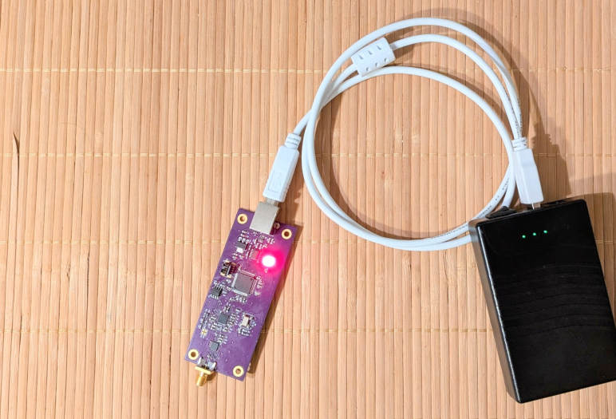
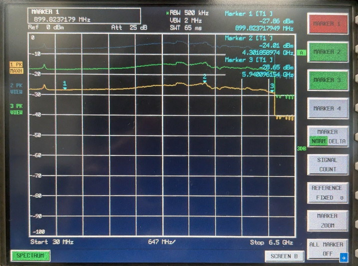

## Stored-program 6 GHz RF signal generator

Basic specs:
 * Frequency range: 23.5 MHz - 6 GHz, in 10 kHz steps   (MAX2871 PLL)
 * Level setting dynamic range: 30 dB (approx. -35 dBm - -5 dBm)
 * Storage: 32 kB EEPROM (programs, calibration data and configuration)
 * Programming: scripting language with BASIC-like syntax
 * Communication interface: USB UART (FT230)
 * Power: +5V, 110mA (via USB)

Runs [this System Software](https://github.com/szoftveres/RF_instruments/tree/main/os), with added functions to support signal generator functionality.

-->> [Schematics](https://github.com/szoftveres/RF_instruments/tree/main/siggen/schematics.pdf) <<--





Frequency- and power sweep (raw output without level calibration), 30 MHz - 6 GHz, in 10dB output level increments:



### Programming

The instrument has a USB UART communication interface, and a 32 kB EEPROM to store programs, level calibration data and configuration.

Frequency can be set (and retrieved) by using the `freq` command (and `freq()` function), the unit is kHz, e.g. `freq 915000` sets the frequency to 915 MHz. The `print <expr>` command prints the value of an *expression*, e.g. `print freq()` prints the current frequency, in kHz.

RF output level can be set (and retrieved) by using the `level` command and/or function, the unit is in dBm, the accepted range is between -30 and 0.

RF output can be turned on or off with the `rfon` and `rfoff` commands.

The current configuration can be printed out with the `cfg` command.
```
> cfg
RF: 915000 kHz, -20 dBm, output on
```
These commands can be part of a program, thereby enabling the signal generator to accomplish complex functions.

```
E:> list
 0 "rfoff"
 1 "freq 900000"
 2 "rfon; sleep 200; rfoff"
 3 "freq (freq () + 1000)"
 4 "if freq() <= 930000 \"goto 2\""
 5 "end"
```
After issuing the `run` command, the above program runs a linear frequency sweep from 900 MHz to 930 MHz in 1 MHz increments, stopping at each frequency point for 200 ms.

A program line can be entered by first typing the line number, followed by the program line in a C-string literal format, e.g. `1 "freq = 900000"`.
If a program line contains nested string literals, the `\` character must be used before the nested double-quote characters, e.g. `4 "if freq <= 930000 \"goto 2\""`, the `if` keyword expects the program line to be executed in the form of a string literal after a TRUE (i.e. non-zero) expression.

The available keywords and commands can be listed with the `help` command:
```
E:> help
  freq (kHz)
  level (dBm)
  amtone  [ms] - AM tone
  fmtone  [dev] [ms] - FM tone
  rfon - RF on
  rfoff - RF off
  format - format EEPROM
  sleep [millisecs] - sleep
  malloctest
  instctltest - test
  help - print this help
  vars - print vars
  clr - clr vars
  ver - FW build
  mem - mem info
  print [expr] "str"
  if [expr] "cmdline" - execute cmdline if expr is true
  exit - exit shell
  new - clear program
  [0-n] "cmdline" - enter command line
  list - list program
  run - run program
  end - end program
  goto [line] - jump
  gosub [line] - call
  return - return
  loadprg "name"
  saveprg "name"
  cd "letter"
  copy "src" "new" <opt:[bytes]>
  dir - list files
  hexdump "file"
  del "file"
  wavfilesrc "file" WAV->
  wavfilesnk "file" ->WAV
  df ->decimating filter [n] <[bf]>->
  nullsnk ->NULL
  sine [fs] [freq] [samples]->
  noise [fs] [samples]->
  txmsg [fs] [fc]->
  rxmsg ->rxmsg [fc]
  loadcfg - load config
  savecfg - save config
  cfg - print cfg
  fmt ("fmt" ...)
  spc (n)
  cos (n cycles)
  sin (n cycles)
```

### 32 kB EEPROM storage

Programs can be loaded or stored as files with the `loadprg` and `saveprg` commands, the contents of the file system can be listed with the `dir` command, files can be deleted using `del` and copied using the `copy` commands, and the contents can be viewed with the `hexdump` commands.

A minimalist, FAT-like filesystem is implemented on top of the 32 kB EEPROM (device "E"), giving permanent storage with efficient usage of space and familiar programming interface (`open`, `close`, `read`, `write`) for any kind of data storage. An identical 32 kB partition is available to store temporary data in RAM (device "M").

```
E:> dir
cfg                 24                  n:01,attr:0x0001,start:0x0014
expsweep            220                 n:02,attr:0x0001,start:0x0015
flsweep             250                 n:03,attr:0x0001,start:0x0019
ismbcon             234                 n:04,attr:0x0001,start:0x001d
swbeacon            194                 n:05,attr:0x0001,start:0x0021
morsebcn            368                 n:06,attr:0x0001,start:0x0025
fmbcn               187                 n:07,attr:0x0001,start:0x002b
primes              248                 n:08,attr:0x0001,start:0x002e
guess               314                 n:09,attr:0x0001,start:0x0032
                    6 entries free
                    457 blocks (29248 Bytes) free
```

### Program examples

Exponential frequency sweep between 50 MHz - 5 GHz, in 1.032x (33/32) increments:
```
 0 "rfoff"
 1 "freq 50000"
 2 "rfon; sleep 200; rfoff"
 3 "freq freq() * 33 / 32"
 4 "if freq() <= 5000000 \"goto 2\""
 5 "end"
```

Linear frequency *and* power sweep; 900 MHz - 930 MHz in 1 MHz steps, -30 dBm - -1 dBm in 1dB steps:
```
 0 "rfoff"
 1 "level -30"
 2 "freq 900000" 
 3 "rfon; sleep 200; rfoff"
 4 "freq freq() + 1000"
 5 "if freq() <= 930000 \"goto 3\""
 6 "level level() + 1"
 7 "if level() < 0 \"goto 2\""
 8 "end"
```

RF CW beacon transmitting at 902 MHz and 928 MHz for 1 second each, every 15 seconds:
```
 0 "rfoff"
 1 "level -3"
 2 "freq 902000" 
 3 "rfon; sleep 1000; rfoff"
 4 "freq 928000" 
 5 "rfon; sleep 1000; rfoff"
 6 "sleep 13000"
 7 "goto 2"
 8 "end"
```

Periodic, 1 kHz AM modulated 25 MHz Shortwave beacon (1 sec on, 1 sec off):
```
 0 "freq 25000; level -10"
 1 "rfon"
 2 "amtone 1000"
 3 "rfoff; sleep 1000"
 4 "goto 1"
```

AM-modulated 25 MHz Morse beacon, sending CQ calls (showing the use of subroutines)
```
 0 "freq 25000; level 0; rfon; sleep 100"
 1 "c = 200; gosub 12"
 2 "c = 50; gosub 12"
 3 "c = 200; gosub 12"
 4 "c = 50; gosub 12"
 5 "sleep 400"
 6 "c = 200; gosub 12"
 7 "c = 200; gosub 12"
 8 "c = 50; gosub 12"
 9 "c = 200; gosub 12"
10 "sleep 100; rfoff; sleep 1000; rfon; goto 1"
11 " "
12 "amtone c"
13 "sleep 100; return"
```

FM beacon for 88.1 MHz - the first parameter of the `fmtone` command is the +/- deviation (in kHz):
```
 0 "freq 88100; rfon"
 1 "fmtone 30 1000"
 2 "rfoff; sleep 1000"
 3 "goto 0"
```

Calculating and printing prime numbers between 3 and 1000, without any RF functionality whatsoever (language Turing-completeness demonstrator):
```
 0 "n = 3; f = 1000"
 1 "d = 1"
 2 "d += 1"
 3 "if d >= n \"goto 7\""
 4 "r = n * (f*10) / d % (f*10)"
 5 "if r==0 \"goto 8\""
 6 "goto 2"
 7 "print n"
 8 "n += 1"
 9 "if n < f \"goto 1\""
```

Number guessing game, demonstrating online input prompt within a program: line `g = ?"Guess [0-99]?"` prints the given message and waits for an online input expression and stores the result in variable 'g'. The expression is pre-evaluated prior to storage, therefore it can range from a single integer number to any compound expression, including all the variables.

```
 0 "rnd ticks()"
 1 "n = rnd() % 100"
 2 "i = 1"
 3 "g = ?\"Guess [0-99]?\""
 4 "if g > n \"goto 7\""
 5 "if g < n \"goto 8\""
 6 "print \"Found out from \" i \" guesses\"; end"
 7 "print \"Too high\"; i += 1; goto 3"
 8 "print \"Too low\"; i += 1; goto 3"
```

