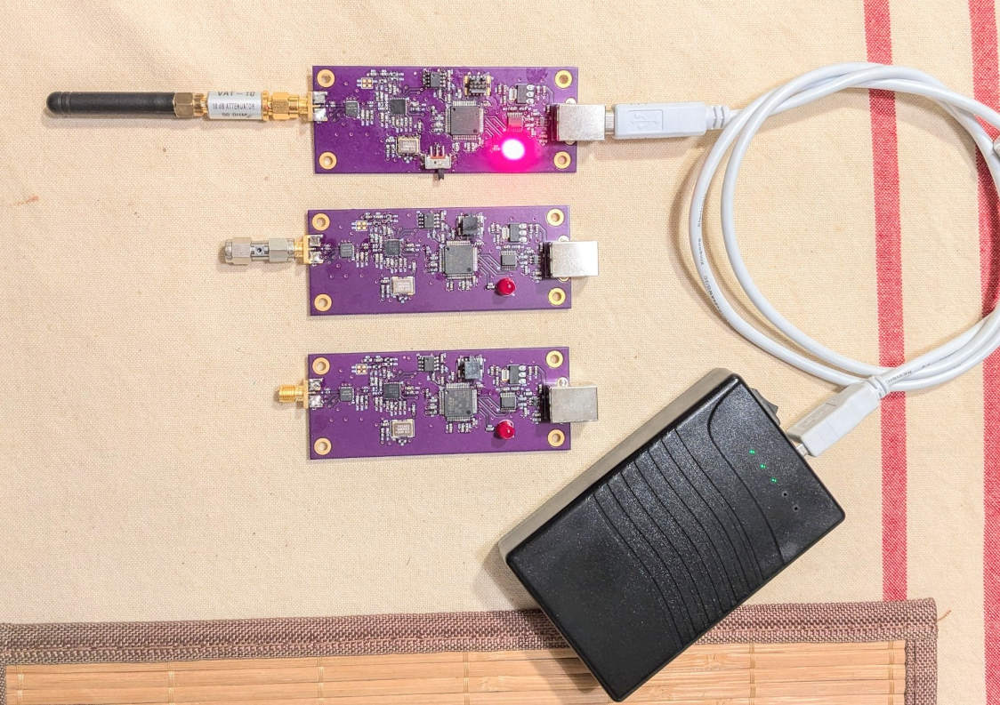

## Stored-program 6 GHz RF signal generator

Basic specs:
 * Frequency range: 23.5 MHz - 6 GHz, in 10 kHz steps   (MAX2871 PLL)
 * Level setting synamic range: 30 dB (approx. -35 dBm - -5 dBm)
 * Executable program size in RAM: 1 kB (16 lines x 64 character)
 * Number of stored programs: 8 (8 x 1 kB in EEPROM)
 * Power: +5V, 110mA (via USB)
 * UART comm interface: 38400 8N1


-->> [Schematics](https://github.com/szoftveres/RF_instruments/tree/main/siggen/schematics.pdf) <<--


### Programming

The signal generator has a USB UART interface (FTDI FT230x) to issue commands to, and an EEPROM to store level calibration data, configuration and program.

Frequency can be programmed by setting the `freq` *resource variable* <sup>[1]</sup>; the unit is kHz, e.g. `freq = 915000` will set the frequency to 915 MHz, `freq += 1000` will increase the current frequency by 1 MHz. The `print <expr>` command can be used to print the value of an expression, e.g. `print freq / 1000` will print the current frequency, in MHz.

<sup>[1]: A resource variable is a variable that is accessible within the program namespace, however accessing its value or assigning value to it might result in additonal actions, e.g. assigning a value to `freq` resource variable also configures the frequency of the MAX2871 PLL.</sup>

RF output level can be set (and retrieved) by using the `level` resource variable, the unit is in dBm, the accepted range is between -30 and 0.

Besides printing out values of resource variables, the current configuration can also be printed out with the `cfg` command.
```
> cfg
RF: 915000 kHz, -20 dBm, output on
```

Besides the `freq` and `level` resource variables, there are 26 *general purpose variables* (`a` - `z`), each holding a 32-bit signed integer. Parentheses `(` `)` can be used in expressions to emphaseize and/or to override built-in operator-precedence, e.g. `a = (150 + b) * freq`. The parser has a complete, full-blown C-style compound expression evaluator with almost every imaginable arithmetic and logic operations and with pre-defined operator precedence.

RF output can be turned on or off with the `rfon` and `rfoff` commands.

A single command line can hold multiple commands, separated by the `;` character; e.g. `rfon; sleep 200; rfoff` commands in a single line will result in the RF output briefly turned on for 200 ms.

The device can also store a short program, which can be saved to the EEPROM and recalled later. The program consists of numbered program lines and can be listed by using the `list` command:

```
> list
 0 "rfoff"
 1 "freq = 900000"
 2 "rfon; sleep 200; rfoff"
 3 "freq += 1000"
 4 "if freq <= 930000 \"goto 2\""
 5 "end"
```
After issuing the `run` command, the above program will run a linear frequency sweep from 900 MHz to 930 MHz in 1 MHz increments, stopping at each frequency point for 200 ms.

A program line can be entered by first typing the line number, followed by the program line in a C-string literal format, e.g. `1 "freq = 900000"`.
If a program line contains nested string literals, the `\` character can be used before the nested double-quote characters, e.g. `4 "if freq <= 930000 \"goto 2\""`, the `if` keyword expects the program line to be executed in the form of a string literal after a TRUE (i.e. non-zero) expression.

The available keywords and commands can be listed with the `help` command:
```
> help
 help - print this help
 rfon - RF on
 rfoff - RF off
 cfg - show cfg
 echoon - Echo on
 echooff - Echo off
 loadprg [n] - load program from file [n]
 saveprg [n] - save program to file [n]
 loadcfg - load config
 savecfg - save config
 eer [page] - peek EEPROM
 sleep [millisecs] - sleep
 print [expr] - print the value
 if [expr] "cmdline" - execute cmdline if expr is true
 [0-16] "cmdline" - enter command line
 new - clear program
 end - end program
 list - list program
 run - run program
 goto [line] - jump
```

### Program examples

Exponential frequency sweep between 50 MHz - 5 GHz, with 1.032x (33/32) increments:
```
 0 "rfoff"
 1 "freq = 50000"
 2 "rfon; sleep 200; rfoff"
 3 "freq = freq * 33 / 32"
 4 "if freq <= 5000000 \"goto 2\""
 5 "end"
```

Linear frequency and power sweep 900 MHz - 930 MHz, -30 dBm - -1 dBm, 1MHz and 1dB steps:
```
 0 "rfoff"
 1 "level = -30"
 2 "freq = 900000" 
 3 "rfon; sleep 200; rfoff"
 4 "freq += 1000"
 5 "if freq <= 930000 \"goto 3\""
 6 "level += 1"
 7 "if level < 0 \"goto 2\""
 8 "end"
```

RF beacon transmitting at 902 MHz and 928 MHz for 1 second each, every 15 seconds:
```
 0 "rfoff"
 1 "level = -3"
 2 "freq = 902000" 
 3 "rfon; sleep 1000; rfoff"
 4 "freq = 928000" 
 5 "rfon; sleep 1000; rfoff"
 6 "sleep 13000"
 7 "goto 2"
 8 "end"
```

Periodic, 300 Hz AM modulated 25 MHz Shortwave beacon - the AM frequency is primarily the function of how quickly the CPU is able to process the program line and send SPI commands to the programmable attenuator.
```
 0 "freq = 25000; echooff" 
 1 "rfon; c = 300"
 2 "level=0; c -= 1; level=-20; if c \"goto 2\""
 3 "rfoff; sleep 4000"
 4 "goto 1"
```

Self-modifying program. After completion, line #5 will be overwritten.
```
 0 "rfoff"
 1 "freq = 900000"
 2 "rfon; sleep 200; rfoff"
 3 "freq += 1000"
 4 "if freq >= 930000 \"5 \\"end\\"\""
 5 "goto 2"
```

Loading and running another program from within a program. After loading, the original program is overwritten in RAM by the new program and cannot be returned into, however the subsequent program can load it and run it again as long as it's saved in the EEPROM.
```
 0 "rfoff"
 1 "freq = 900000"
 2 "rfon; sleep 200; rfoff"
 3 "freq += 1000"
 4 "if freq >= 930000 \"loadprg 2; run\""
 5 "goto 2"
```

Calculating and printing prime numbers between 3 and 1000, without any RF functionality whatsoever (language Turing-completeness demonstrator):
```
 0 "n = 3; f = 1000"
 1 "d = 1"
 2 "d += 1"
 3 "if d >= n \"goto 7\""
 4 "r = n * (f*10) / d % (f*10)"
 5 "if r==0 \"goto 8\""
 6 "goto 2"
 7 "print n"
 8 "n += 1"
 9 "if n < f \"goto 1\""
```



Frequency- and power sweep, without level calibration, 50 MHz - 6 GHz, in 10dB output level increments:


