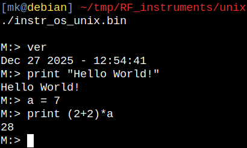

## Unix runtime / development environment for the [OS library](https://github.com/szoftveres/RF_instruments/tree/main/os)

Makes development and testing of the [OS library](https://github.com/szoftveres/RF_instruments/tree/main/os) possible on PC (i.e. without having to use actual embedded hardware).

Build and run:

```
make
./instr_os_unix.bin

```


