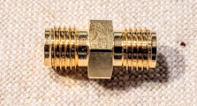
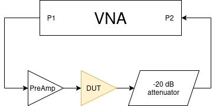
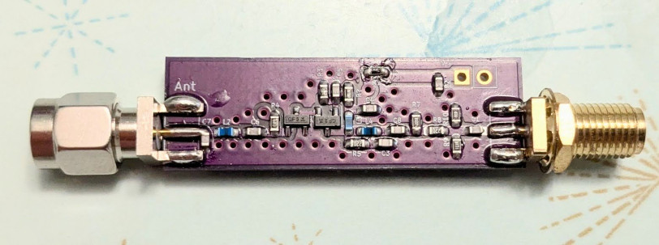
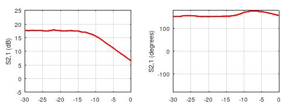

## 6 GHz Vector Network Analyzer with Adjustable Power Level

Basic specs:
 * Frequency range: 23.5 MHz - 6 GHz, in 10 kHz steps   (MAX2871 PLL)
 * Level setting dynamic range: 30 dB (approx. -35 dBm - -5 dBm)

### Motivation

Hobby-level low-cost vector network analyzers (like the LiteVNA) are capable of reaching higher frequencies, with mediocre performance at the higher end of the spectrum (reduced S1,1 dynamic range, due to cheap coupler design and bad directivity). An even more serious limitation is the inability to adjust or lower the RF power level at which the measurement is made, which precludes any measurement on active small-signal devices, like LNAs, RFICs and mixers. Most basic VNAs have a fixed output RF level typically around 0 dBm (maybe adjustable by a couple of dB's) which brings typical small-signal devices well into their non-linear / compression region. While technically the power level could be externally lowered by using an attenuator between the active device and the VNA (and calibrating it into the system), the attenuator also attenuates the reflected waves, resulting in a dramatic loss of (already limited) dynamic range in the S1,1 measurement, making the input matching / tuning characterization of small-signal active devices practically impossible.

When RF power of the VNA is adjustable at the source, reflection measurements can be made with high dynamic range at low power level settings. Also, since the reference path is also affected by the attenuation, theoretically the VNA always stays calibrated even if the RF power level is changed on the fly (this is not entirely true in practice, due to the internal non-linearities of the VNA). Moreover, power sweeps can also be accomplished very easily, which is an essential measurement for characterizing active devices.

An RF power source in the VNA with gradually adjustable power level therefore opens up many new possibilities and makes the instrument highly capable. It is a premium feature of VNAs, usually commercial > 6 GHz VNAs with RF level setting option are at premium prices (an economical 4.5 GHz Siglent SNA5002A costs somewhere near $10k), so DIY is a much more economical solution.

### Description

The hardware consists of two main components:

 * The RF board is responsible for all RF functionalities and analog IF processing
 * The [DSP / controller board](https://github.com/szoftveres/RF_instruments/tree/main/dsp_stm32H7) takes care of all the data acquisition, initial digital signal processing, controlling functions and communicating with the host PC.

The RF board is mostly made of off-the shelf parts, except for the broadband coupler, which is a custom design based on [1](http://www.ke5fx.com/Broadband_Coupler_Dunsmore.pdf) and [2](https://hforsten.com/improved-homemade-vna.html). Since the coupling factor is -16 dB, I decided to add two TRF37A73 broadband LNAs to bring back the signal level in order to preserve dynamic range at low RF power setting. RF signal is generated by a MAX2871 PLL, followed by a BDA4700 programmable RF attenuator (this combo is the basis of my [RF signal generator](https://github.com/szoftveres/RF_instruments/tree/main/siggen)). The LO is generated by another MAX2871 PLL and is fed directly into an ADL5802 dual mixer. One complete mixer & IF path is fuly dedicated to the RF reference, for simultaneous data acquisition of reference- and measured paths, in order to always ensure fixed phase relationship between the reference and the measured signal. A high-isolation, non-reflective SPDT switch (Qorvo QPC6324) selects between reflected- or through RF signal paths. The mixer outputs (two differential open-drain ports - Gilbert-cells) expect relatively high Idd (240mA) at almost Vdd, making resistive loading impossible, therefore the loads are implemented with two center-tapped inductors, resonated at IF by capacitors and resistively degenerated for phase-stability. The differential IFs are converted into single-ended signals, further amplified, filtered and fed directly into the ADCs of the microcontroller. The board is impedance-controlled 4-layer OSHpark job.

-->> [RF board schematics](VNA_RF_schem.pdf) <<--

The RF and DSP / controller boards are connected together with short ribbon cables, with a ground wire (or capacitively grounded power wire) going between each signal wire, in order to ensure minimal crosstalk (G-S-G-S-G... topology). All the digital lines (20 MHz reference clock, SPI, GPIO) are damped by 47 Ω resistors. The analog IF lines are also driven by 47 Ω source impedance and are capacitively filtered on both ends for higher frequencies - since the IF frequency is low (10 kHz), no further cable shielding is necessary.

The [DSP / controller board](https://github.com/szoftveres/RF_instruments/tree/main/dsp_stm32H7) (schematics [here](https://github.com/szoftveres/RF_instruments/tree/main/dsp_stm32H7/schematics.pdf)) is made to be general-purpose and fits into a small ecosystem of STM32 based devices running my [OS](https://github.com/szoftveres/RF_instruments/tree/main/os) and can be reconfigured for various tasks, including data acquisition, storage, controlling, etc..

The STM32 microcontroller samples both (reference and measurement) IF signals simultaneously at 80 ksps with its two 16-bit ADCs. The IFs are down-converted in the digital domain by two complex mixers ([a lookup-table based DDS](https://github.com/szoftveres/RF_instruments/tree/main/os/dsp_maths.c#L23) generates the 10 kHz LO for the digital mixers) and 800 samples are accumulated. When a full acquisition cycle is completed, the result (complex reference- and measured baseband values) is sent to the host PC for further processing. Since the 20 MHz reference clock is shared between the RF PLLs and the microcontroller, there's always a perfect phase coherence between the analog IF signal, the ADC clock and the DDS. The DSP / controller board is also responsile for controlling the RF board via SPI bus and GPIO.

The [host software](https://github.com/szoftveres/RF_Microwave/tree/main/instrctl/vna.m) is built on top of GNU Octave and my [RF toolkit library](https://github.com/szoftveres/RF_Microwave/tree/main/RFlib), and is communicating with the DSP / controller board via UART. A benefit of doing the initial signal processing on the DSP / controller board is that only several bytes need to be transferred per each measurement point, hence the low baud rate of the UART is not a factor.

### Calibration and Performance

Several great methods (like the 12-term error model) have been developed for 2-port VNA calibration which (among other things) account for leakage and port impedance mismatch. These models assume that the non-perfect terminating impedance of Port 2 of the VNA is constant during reflected- and through measurements, and correct for it. This is not the case however with this VNA; during reflected measurement, the QPC6324 switch terminates Port 2, while during through measurement, the switch connects Port 2 to the input port of the mixer. The difference between these two matching conditions can be decreased to some degree by using an attenuator (pad) on Port 2 (the PCB includes a 3 dB pad between Port 2 and the QPC6324 switch), however this comes at the expense of reduced S2,1 dynamic range. Therefore, the error correction process on this VNA is separated into through- and reflected cases.

The reflected (S1,1) error correction is based on the well-known 3-term error model (implementation [here](https://github.com/szoftveres/RF_Microwave/tree/main/RFlib/p1cal.m)). I'm using a simple DIY SMA cal kit and treating them as perfect standards (reflection coefficients for the open- short and load are 1, -1 and 0 respectively, at all frequencies), which is far from ideal; gaining access to a high-quality cal kit and its models would allow for characterizing this DIY cal kit and building proper models (the 3-term error correction metod is capable of precise error correction if the cal kit parameters are known and accurate models can be built for them).

Since the 3-term model is unaware of Port 2 and expects perfect termintaion of a multi-port multilateral network on every port, a precise S1,1 measurement requires the other port of such network (e.g. a bidirectional passive filter) to be momentariy disconnected from Port 2 and terminated by a good quality load (e.g. the load cal standard). This is not much of an issue with uni-lateral two-port networks where the reverse path from Port 2 is well isolated (e.g. amplifiers with good reverse isolation, or an output attenuator calibrated into S2,1) or not involved at all (e.g. S11 measurement of antennas).

On this VNA, S1,1 dynamic range is more than 40 dB across the full frequency span at -25 dB attenuator setting (approximately -30 dBm RF power on Port 1), which allows for very precise (> 20 dB) input tuning of small-signal active devices (e.g. LNAs) in their linear region, with a healthy 20 dB of extra margin. The dynamic range improves with increased power level.

The through (S2,1) calibration is based on through standard and isolation measurements. Technically only a through calibration measurement would be sufficient as long as the isolation between the two ports was acceptable (isolation would ensure the dynamic range). The corrected S2,1 in this case is the quotient of the measured S2,1 and the S2,1 of the through standard:

On this VNA, through-only correction results is a somewhat limited dynamic range, because of lack of proper isolation (being built on a single PCB, with parts close to each other and not being shielded):

The dynamic range can be increased by including the signal leakage (isolation) into the equation. The assumption is that the leakage adds to the S2,1 measurment of the through standard as well as to the S2,1 measurements of the DUT, therefore once it is known ("isolation" calibration measurement), it can be subtracted. The equation changes like this:

The result is some ~ 20 dB S2,1 dynamic range improvement on this VNA. Any further improvement can only be realistically expected by using proper isolation and shielding.

This simple through error correction method assumes a perfect through standard i.e. doesn't take delay and loss into account, but this isn't really a problem or a practical limitation. A short, high quality SMA through has virtually zero loss, and knowing its absolute delay (or phase shift) at the SMA connector plane has little practical value. There are some cases where being able to measure the *absolute* S2,1 phase shift of a device is necessary (e.g. a phase shifter IC); these devices are usually mounted on a small coupon board, which also features a deembedding through trace. This deembedding trace can be perfectly used as a through cal standard, resulting in the ability to make accurate *absolute* phase and gain/loss measurements at the device level. In most other practical cases, being able to make *comparative* measurement (e.g. phase shift of a DUT due to changing conditions, comparing the phase difference of two similar DUTs, etc..) is the only requirement.

### Measurements

#### Bandpass stub filter for the 420 MHz - 450 MHz amateur band

DIY two-element high-Q bandpass filter

Measured with this VNA:

Measured using a LiteVNA:

The slight difference in the reflection at the higher band edge (~ 450 MHz) is due to the fact that the matching conditions for the two setups (different Port 2 impedances of the two VNAs, different measurement cables) are different, and the S11 correction of this VNA doesn't account for imperfect Port 2 impedance (it's assumed to be perfect 50 Ω).

#### 915 MHZ SAW filter

Abracon AFS915.0W03-TS3 ISM band filter mounted on a DIY SMA breakout board

Measured:

From the datasheet:

#### SMA cable phase stability measurement

A cheap RG316 SMA cable was included in the through calibration, then it was bent at a sharp curve to observe phase change at high frequency.

Straight:

Bent:

The difference between straight and bent states at 5.5 GHz is approximately -2.7°, meaning that the delay slightly decreases with bending, presumably because the center conductor is squished and therefore the RF path is shortened. After straightening the cable out, the phase shift returned to near its original value.

#### Power sweep

S2,1 power sweep of a [discrete BJT LNA](https://github.com/szoftveres/RF_microwave/tree/main/Amplifier/cascode) at 915 MHz, showing gain compression with increasing input power. The VNA can only provide about -5 dBm RF power at its maximum output setting, which is barely sufficient to overdrive the DUT LNA, hence a driver preamp was added, which brings up the maximum power level to about +5 dBm; this preamp as well as a 20 dB attenuator was included in the through calibration.

The DUT:

Power sweep:

Linearity of the measurement system:

The driver preamp is capable of producing more than +10 dBm on its output before saturation, therefore it is able to operate in its linear region up to the maximum required +5 dBm level (it has 10 dB gain and the VNA can produce -5 dBm at most). The combined insertion loss of the DUT (LNA with 18 dB gain) and the 20 dB attenuator is -2 dB, which could theretically bring the VNA Port 2 receiver into compression by exposing it to +3 dBm power level (which is more than what it's designed for). However the DUT starts compressing approximately 10 dB below that point, therefore the power level at the VNA receiver never reaches more than approximately -5 dBm, which is within its linear region. The output of the LNA is tuned, meaning that higher order harmonic products that could also reach high levels (inherent result of overdriving the DUT) are naturally attenuated.

Since the reference changes together with the measured path, theoretically the VNA would stay in calibration even if it was calibrated only at a single power setting. This is not realistic however; the mixer as well as the amplifiers don't stay fully linear across their dynamic range, hence calibration for the full measurement range must be carried out for power sweeps as well.

