## 6 GHz Vector Network Analyzer with Adjustable Power Level

Basic specs:
 * Frequency range: 23.5 MHz - 6 GHz, in 10 kHz steps   (MAX2871 PLL)
 * Level setting dynamic range: 30 dB (approx. -35 dBm - -5 dBm)

### Motivation

Cheap vector network analyzers (like the LiteVNA) are capable of reaching higher frequencies, although performance (S1,1 dynamic range, due to bad coupler directivity) is mediocre at most at 6 GHz. An even more serious limiting factor is the inability to make masurements at low RF power levels. Most basic VNAs have a fixed output level (typically near 0 dBm, maybe adjustable by a couple of dB's) which brings typical small-signal devices (LNAs, RFICs, active mixers) well into the non-linear / compression region. While technically the power level can be externally lowered by using an attenuator between the active device and the VNA (and calibrating it into the system), the attenuator also attenuates the reflected waves, resulting in a dramatic loss of (already limited) dynamic range in the S1,1 measurement, making the input matching / tuning characterization of small-signal active devices practically impossible.

A better solution is to build a programmable attenuator into the VNA, after the RF source but before the coupler. The result is that the S1,1 dynamic range doesn't suffer nearly as much loss, thereby making small-signal active device characterization possible, without overdriving them - also, since the reference path is also affected by the attenuation, theoretically the VNA always stays calibrated even if the RF power level is changed on the fly (this is not entirely true, due to non-linearities of the VNA).

Usually commercial > 6 GHz VNAs with RF level setting option are at premium prices (an economical 4.5 GHz Siglent SNA5002A costs somewhere near $10k), so DIY is a much more economical solution.

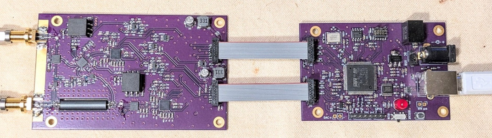

### Description

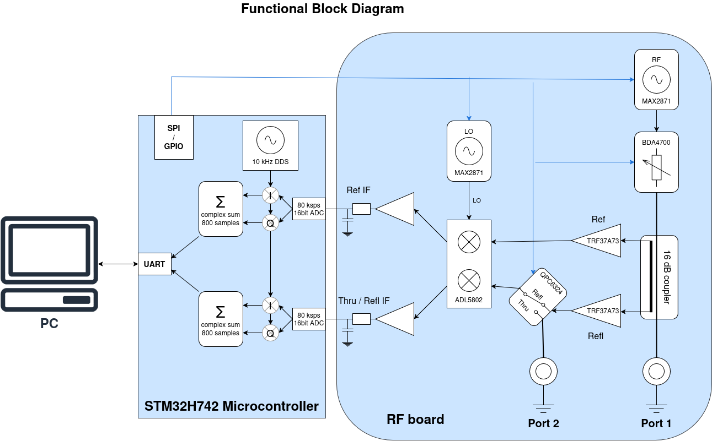

The hardware consists of two main components:

 * The RF board is responsible for all RF functionalities and analog IF processing
 * The [DSP / controller board](https://github.com/szoftveres/RF_instruments/tree/main/dsp_stm32H7) takes care of all the data acquisition, initial digital signal processing, controlling functions and communicating with the host PC.

The RF board is mostly made of off-the shelf parts, except for the broadband coupler, which is a custom design based on [1](http://www.ke5fx.com/Broadband_Coupler_Dunsmore.pdf) and [2](https://hforsten.com/improved-homemade-vna.html). Since the coupling factor is -16 dB, I decided to add two TRF37A73 broadband LNAs to bring back the signal level in order to preserve dynamic range at low RF power setting. RF signal is generated by a MAX2871 PLL (also used [here](https://github.com/szoftveres/RF_instruments/tree/main/siggen)), followed by a BDA4700 programmable RF attenuator. The LO is generated by another MAX2871 PLL and is fed directly into an ADL5802 dual mixer. One complete mixer & IF path is fuly dedicated to the RF reference, for simultaneous data acquisition of reference- and measured paths, in order to always ensure fixed phase relationship between the reference and the measured signal. A high-isolation, non-reflective SPDT switch (Qorvo QPC6324) selects between reflected- or through RF signal paths. The mixer outputs (two differential open-drain ports - Gilbert-cells) expect relatively high Idd (240mA) at almost Vdd, making resistive loading impossible, therefore the loads are implemented with two center-tapped inductors, resonated at IF by capacitors and resistively degenerated for phase-stability. The differential IFs are converted into single-ended signals, further amplified, filtered and fed directly into the ADCs of the microcontroller. The board is impedance-controlled 4-layer OSHpark job.

-->> [RF board schematics](VNA_RF_schem.pdf) <<--

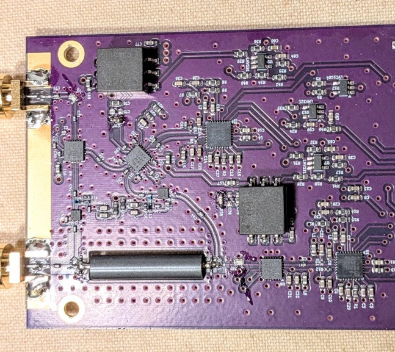

The connection between the analog and digital boards is made using short ribbon cables, with each signal line being surrounded by ground (or capacitively grounded power rail) in order to ensre minimal crosstalk between the lines (G-S-G-S-G... topology). All the digital lines (20 MHz reference clock, SPI, GPIO) are damped by 47 Ω resistors. The analog IF lines are also driven by 47 Ω source impedance and are filtered on both ends for higher frequencies - since the IF frequency is low (10 kHz), no further cable shielding is necessary.

The [DSP / controller board](https://github.com/szoftveres/RF_instruments/tree/main/dsp_stm32H7) ([schematics](https://github.com/szoftveres/RF_instruments/tree/main/dsp_stm32H7/schematics.pdf)) samples both (reference and measurement) IF signals simultaneously at 80 ksps with its two 16-bit ADCs. The IFs are down-converted in the digital domain by two complex mixers (a lookup-table based DDS generates the 10 kHz LO for the digital mixers) and 800 samples are accumulated (also a raised-cosine window is applied on the samples). When a full acquisition cycle is completed, the result (complex reference- and measured baseband values) is sent to the host PC for further processing. Since the 20 MHz reference clock is shared between the RF PLLs and the microcontroller, there's always a perfect phase coherence between the analog IF signal, the ADC clock and the DDS. The DSP / controller board is also responsile for controlling the RF board via SPI bus and GPIO. The board is running this [OS](https://github.com/szoftveres/RF_instruments/tree/main/os), therefore implementing its services.

The [host software](https://github.com/szoftveres/RF_Microwave/tree/main/instrctl/vna.m) is built on top of GNU Octave and my [RF toolkit library](https://github.com/szoftveres/RF_Microwave/tree/main/RFlib), and is communicating with the DSP / controller board via UART. A benefit of doing the initial signal processing on the DSP / controller board is that only several bytes need to be transferred via the UART per each measurement point, hence the baud rate is not a factor. The drawback is that the individual samples are not available at the host, therefore some parameters (like the windowing function) can only be modified by changing the firmware.

### Calibration and Performance

Several great methods (like the 12-term error model) were developed for 2-port VNA calibration which (among other things) account for leakage and port impedance mismatch. These models assume that the port impedances (matching conditions) stay constant for the reflected- and through measurements. This is not the case however with this VNA; during reflected measurement, the QPC6324 switch terminates Port 2, while during through measurement, the switch connects Port 2 to the input port of the mixer. The difference between these two matching conditions can be decreased by using an attenuator (pad) on Port 2 (the PCB includes a 3 dB pad between Port 2 and the QPC6324 switch) to some degree, however this comes at the expense of reduced S2,1 dynamic range. Therefore, the error correction process on this VNA is separated into through- and reflected cases.

The reflected (S1,1) error correction is based on the well-known 3-term error model (implementation [here](https://github.com/szoftveres/RF_Microwave/tree/main/RFlib/p1cal.m)), the accuracy depends on the knowledge of the actual cal kit parameters (the method is capable of precise error correction if the cal kit parameters are known and models can be built for them). I'm using a simple DIY SMA cal kit and treating them as perfect standards (reflection coefficients for the open- short and load are 1, -1 and 0 respectively, at all frequencies), which is far from ideal; having access to a quality cal kit and its models would allow for characterizing this DIY cal kit and building proper models.

Since the 3-term model expects perfect termintaion on all other ports for multi-port multilateral networks, a precise S1,1 measurement of such network (e.g. a passive filter) requires the other terminal to be momentariy disconnected from Port 2 and terminated by a good quality load (e.g. the load cal standard). This is not much of an issue as long as Port 2 is well isolated (e.g. uni-lateral networks, amplifiers with output attenuator calibrated into S2,1) or not involved at all (e.g. antennas).

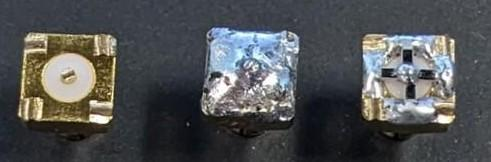

On this VNA, at -25 dB attenuator setting (approximately -30 dBm RF power on Port 1) S1,1 dynamic range is more than 40 dB across the full frequency span, which allows for very precise (> 20 dB) input tuning of small-signal active devices (e.g. LNAs) with a healthy 20 dB of extra margin. The dynamic range improves with increased power level.

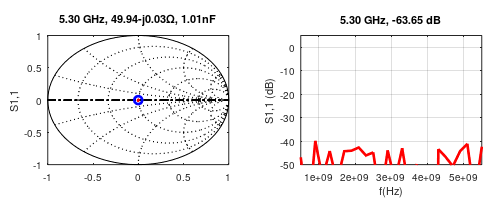

The throguh (S2,1) calibration is based on through standard and isolation measurements. Technically only a through calibration measurement would be sufficient as long as the isolation between the two ports was acceptable; in this case the dynamic range would be ensured by the isolation. The corrected S2,1 in this case is the quotient of the measured S2,1 and the S2,1 of the through standard:

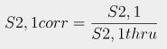

On this VNA, the result of through-only correction is a somewhat limited dynamic range, because of lack of proper isolation (being built on a single PCB, with parts close to each other and not being shielded):

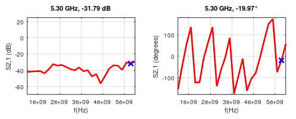

The dynamic range can be increased by including the signal leakage (isolation) into the equation. The assumption is that the leakage adds to the S2,1 measurment of the through standard as well as to the S2,1 measurements of the DUT, therefore once it is known ("isolation" calibration measurement), it can be subtracted. The equation changes like this:

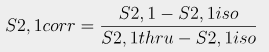

The result is some ~ 20 dB S2,1 dynamic range improvement on this VNA. Any further improvement can only be realistically expected by using proper isolation and shielding.

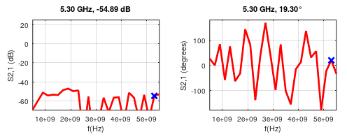

### Measurements

#### Bandpass stub filter for the 420 MHz - 450 MHz amateur band

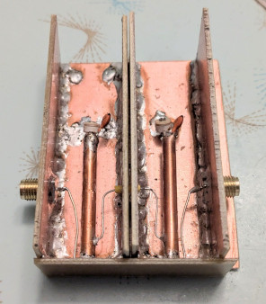

Measured with this VNA:

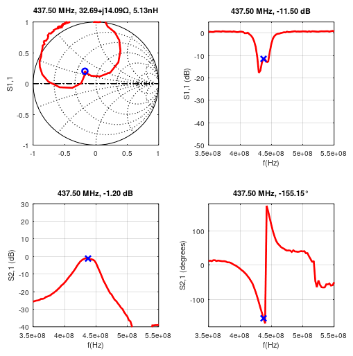

Measured using a LiteVNA:

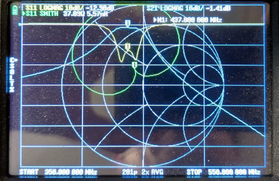

The slight difference in the reflection at the higher band edge (~ 450 MHz) is due to the fact that the matching conditions for the two setups (different Port 2 impedances of the two VNAs, different measurement cables) are different, and the S11 correction of this VNA doesn't account for imperfect Port 2 impedance (it's assumed to be perfect 50 Ω).

#### 915 MHZ SAW filter

Abracon AFS915.0W03-TS3

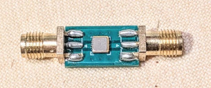

Measured:

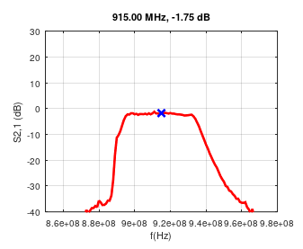

From the datasheet:

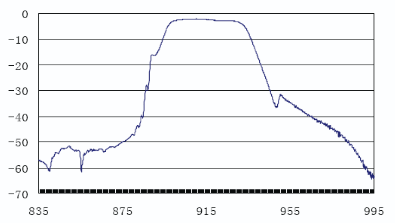

#### SMA cable phase stability measurement

A cheap RG316 SMA cable was included in the through calibration, then it was bent at a sharp curve to observe phase change at high frequency.

Straight:

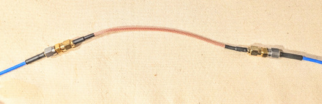

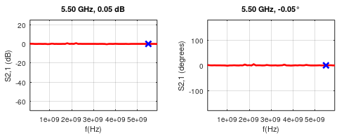

Bent:

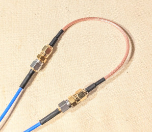

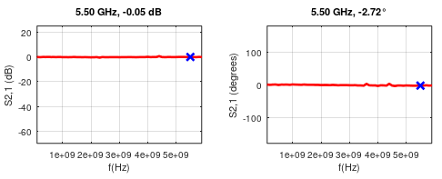

Conclusion: the difference between straight and bent states at 5.5 GHz was approximately 1.5°, which is (surprisingly) negligible.

