# 6 GHz Vector Network Analyzer

Specifications:
 * Frequency range: 23.5 MHz - 6 GHz, resolution: 10 kHz
 * RF output level: min: - 35 dBm, max: - 5 dBm, resolution: 0.25 dB
 * IF bandwidth: 100 Hz
 * S11 dynamic range: >40 dB
 * S21 dynamic range: >50 dB

## Motivation

Hobby-level low-cost vector network analyzers (like the LiteVNA) are capable of reaching higher frequencies, but the inability to decrease the RF power level precludes any meaningful measurement on active small-signal devices, like LNAs, RFICs and active mixers. The RF output level of these basic VNAs is at around 0 dBm, which drives active devices into their non-linear / compression region. Placing a passive attenuator after Port 1 attenuates the reflected waves too, resulting in a dramatic loss of (already limited) dynamic range of the S1,1 measurement.

When a programmable attenuator is built into the VNA before the RF coupler, it opens up many possibilities, like being able to carry out power sweeps, as well being able to measure small-signal devices with plenty of dynamic range, which is the main target of this project.

Adjustable RF output level is a premium VNA feature; a budget-class Siglent SNA5002A 4.5 GHz VNA costs somewhere near $10k, therefore DIY is a much more economical solution.

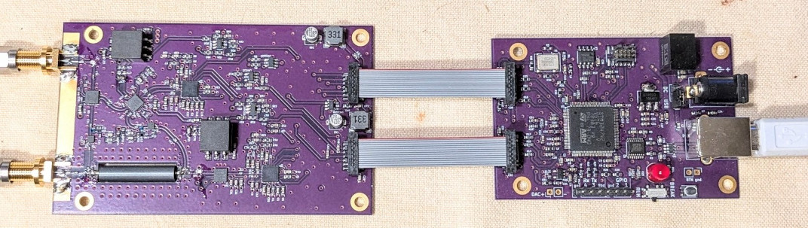

## Description

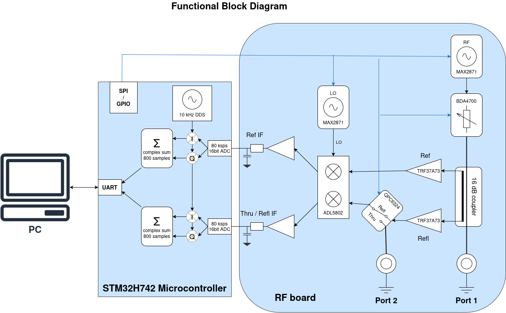

#### RF Board

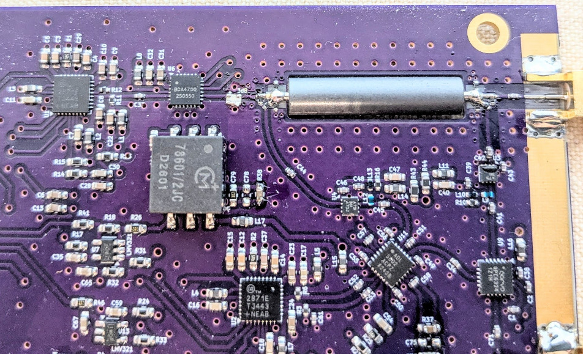

**[-->> RF board schematics <<--](VNA_RF_schem.pdf)**

The most critical part of the VNA is the 16 dB broadband coaxial directional coupler, which is a custom design based on [1](http://www.ke5fx.com/Broadband_Coupler_Dunsmore.pdf), [2](https://ieeexplore.ieee.org/document/7345756) and [3](https://hforsten.com/improved-homemade-vna.html); the prototype version showed more than 12 dB directivity up to 6 GHz. At the lowest RF level settings the signal level at the coupled ports can be extremely low, therefore I added two TRF37A73 broadband LNAs to improve the dynamic range; at the highest RF power level setting (~ -5 dBm on VNA Port 1) the LNAs and the mixers still have approximately 10 dB headroom.

Directional coupler prototype:

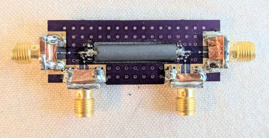

I mostly reused the design and layout work from my previous [RF signal generator](https://github.com/szoftveres/RF_instruments/tree/main/siggen) (MAX2871 PLL and BDA4700 attenuator), and extended it with the aforementioned directional coupler and LNAs, an ADL5802 mixer, a Qorvo QPC6324 high-isolation RF switch, and IF/baseband analog circuitry, to make it a functional vector network analyzer.

#### DSP / Controller Board

-->> **[Schematics](https://github.com/szoftveres/RF_instruments/tree/main/dsp_stm32H7/schematics.pdf)** <<--

The entire VNA is running from a common 20 MHz reference clock, which originates from the DSP / Controller board, so the RF PLLs and the STM32 microcontroller are always in sync. This results in a perfect phase coherence between the analog IF signal, the ADC clock and the DDS; this allows digital signal processing without windowing, the 10kHz IF during a full acquisition cycle is always perfectly cyclic. 

The microcontroller takes 800 samples of both (reference and measurement) 10 kHz IF signals simultaneously at 80 ksps and calculates the baseband complex measurements by mixing the IFs with a DDS-based LO in software; the result (complex reference- and measured baseband values) is sent to the host PC for further processing. A benefit of doing all the sample acquisition and IF processing on the DSP / controller board is that only several bytes need to be transferred per each measurement point, hence the low baud rate of the USB UART is not a factor. The design of the board is [covered here](https://github.com/szoftveres/RF_instruments/tree/main/dsp_stm32H7).

The RF and DSP / controller boards are connected together with short ribbon cables, with a ground wire (or capacitively grounded power wire) going between each signal wire, in order to ensure minimal crosstalk (G-S-G-S-G... topology). All the digital lines (20 MHz reference clock, SPI, GPIO) are damped by 47 Ω resistors. The analog IF lines are also driven by 47 Ω source impedance and are capacitively filtered on both ends for higher frequencies - since the IF frequency is low (10 kHz), no further cable shielding is necessary. The DSP / controller board is also responsile for controlling the PLLs, attenuator and the RF switch on the RF board via SPI bus and GPIO.

#### Host PC software

The [host software](https://github.com/szoftveres/RF_Microwave/tree/main/instrctl/vna_gui.m) is built on top of GNU Octave and my [RF toolkit library](https://github.com/szoftveres/RF_Microwave/tree/main/RFlib), and is communicating with the DSP / controller board via USB UART. The host PC software is repsonsible for issuing the measurement commands to the DSP / Controller board, receiving data, applying error correction, plotting the results, and saving / recalling the configuration.

GNU Octave has some built-in functions and widgets that can be used to create a simple GUI; the benefit is that (just like with Python) the resulting software can run on most major OS platforms (Linux, Windows, Mac); these UI toolkits are also available in Matlab.

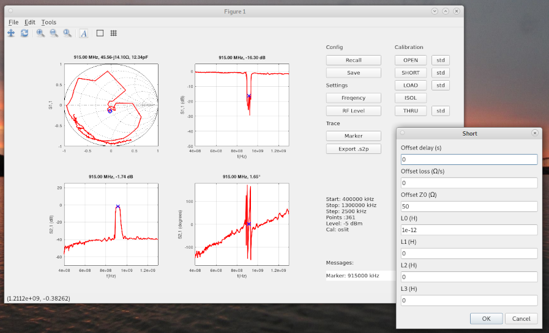

## Calibration and Performance

Several error correction methods ara avilable (like the 12-term error model) for a 2-port VNA, these methods assume that the non-perfect input impedance of Port 2 of the VNA is constant during the entire measurement process, and correct for it. This is not the case however with this VNA; during reflected measurement, the QPC6324 RF switch terminates Port 2, while during through measurement, the switch connects Port 2 to the input port of the mixer; therefore, the error correction process on this VNA is separated into through- and reflected cases.

The reflected (S1,1) error correction is based on the well known 3-term error model (implementation [here](https://github.com/szoftveres/RF_Microwave/tree/main/RFlib/p1cal.m)), the VNA can be calibrated with high-quality standards, the cal-kit parameters can be supplied in a HP-Agilent-Keysight format. Most of the time however I'm using a simple DIY SMA connector cal kit and assuming the standards to be "perfect" (reflection coefficients for the open- short and load are 1, -1 and 0 respectively, at all frequencies), which brings the calibration plane right to the board edge; this works out well enough, especially at sub-GHz. A limitation of the 3-term error correction is that it assumes perfect termintaion on every port of a multi-port multilateral network, so a precise S1,1 measurement of e.g. a passive bandpass filter requires the other port to be terminated by a good quality load (e.g. the load cal standard), because Port 2 termination is not nearly as good. This is not much of an issue with uni-lateral two-port networks where the reverse path from Port 2 is well isolated (e.g. amplifiers with good reverse isolation, or an output attenuator calibrated into S2,1) or not involved at all (e.g. S11 measurement of antennas).

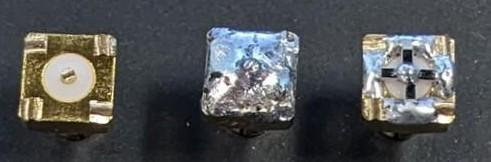

On this VNA, S1,1 dynamic range is more than 40 dB across the full frequency span at -25 dB attenuator setting (approximately -30 dBm RF power on Port 1), which allows for very precise (> 20 dB) input tuning of small-signal active devices (e.g. LNAs) in their linear region, with a healthy 20 dB of extra margin. The dynamic range improves with increased power level.

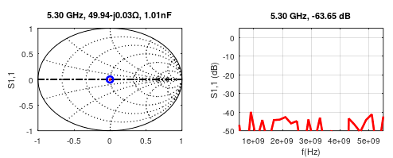

The through (S2,1) error correction is based on through and isolation measurements. Technically only a through measurement would be sufficient as long as the isolation between the two ports was acceptable (isolation would ensure the dynamic range). The corrected S2,1 in this case is the quotient of the S2,1 of the DUT and the S2,1 of the through standard:

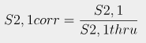

This simple through error correction method assumes that the through standard is perfect, i.e. doesn't take delay and loss into account, but in practice this isn't really a problem or a limitation. A short, high quality SMA through has virtually zero loss (at least as long as laboratory-grade accuracy is not a requirement), and knowing its absolute delay or phase shift at the SMA connector plane has little practical value. There are some cases where being able to measure the *absolute* S2,1 phase shift of a device is necessary (e.g. a phase shifter IC); these devices are usually mounted on a small coupon board, which also features a deembedding through trace. This deembedding trace functions as a through standard, thereby bringing the calibration plane right to the device pins. In most other practical cases, being able to make *comparative* measurement (e.g. phase shift of a DUT due to changing conditions, comparing the phase difference of two similar DUTs, etc..) is the only requirement.

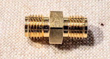

On this VNA, through-only correction results is a somewhat limited dynamic range, because of lack of proper isolation (leakage of the QPC6324 RF switch, as well as being built on a single PCB, with parts close to each other and not being shielded):

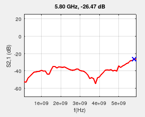

The dynamic range can be increased by measuring the signal leakage and including it into the equation. The assumption is that the leakage adds to the S2,1 of the through standard as well as to the S2,1 of the DUT, therefore once it is known ("isolation" calibration), it can be subtracted. The equation changes like this:

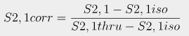

The result is some ~ 20 dB S2,1 dynamic range improvement on this VNA. Any further improvement can only be realistically expected by using proper shielding and ensuring adequate isolation.

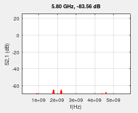

## Measurements

#### 440 MHz GaAs Low Noise Amplifier

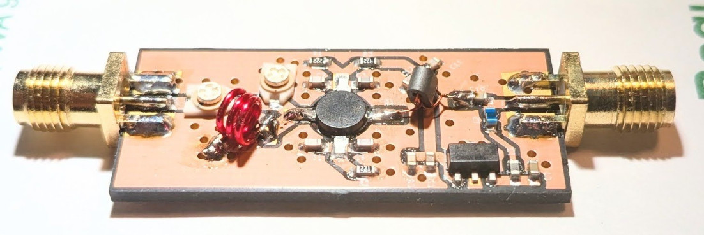

The design is [covered here](https://github.com/szoftveres/RF_Microwave/tree/main/Amplifier/gaas_mesfet). RF power level was set to about -25 dBm. A 20 dB attenuator was added before Port 2 (included in the through calibration), to protect the VNA receiver from overload and also to give the LNA a good termination.

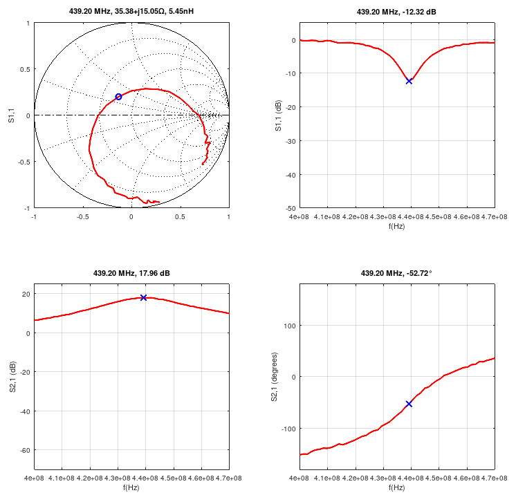

Measuring a small-signal device like this LNA at such low power level requires a (commercially expensive) VNA that has RF level setting capability and sufficient dynamic range; this inexpensive DIY VNA has no problem with it.

#### Bandpass stub filter for the 420 MHz - 450 MHz amateur band

DIY two-element high-Q bandpass filter

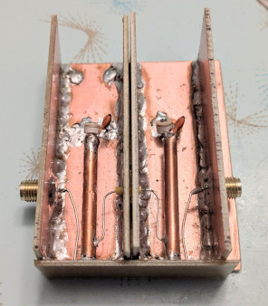

Measured with this VNA:

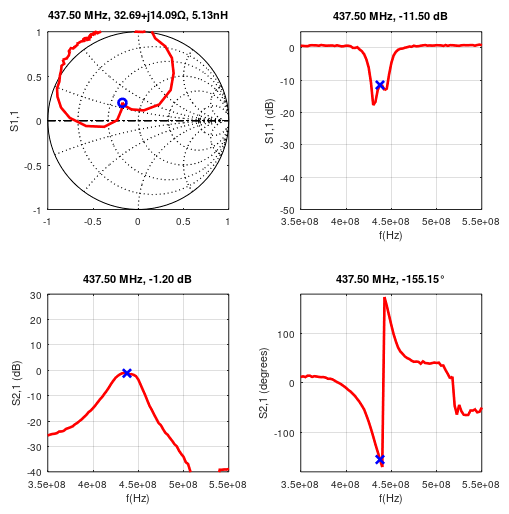

Measured using a LiteVNA:

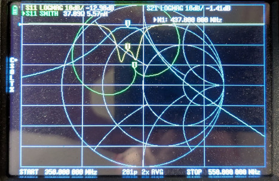

The slight difference in the reflection at the higher band edge (~ 450 MHz) is due to the fact that the matching conditions for the two setups (different Port 2 impedances of the two VNAs, different measurement cables) are different, and the S11 correction of this VNA doesn't account for imperfect Port 2 impedance (it's assumed to be perfect 50 Ω, as described above in the calibration section).

#### 915 MHZ SAW filter

Abracon AFS915.0W03-TS3 ISM band filter mounted on a DIY SMA breakout board

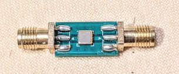

Measured:

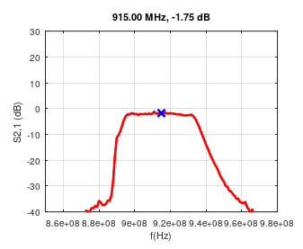

From the datasheet:

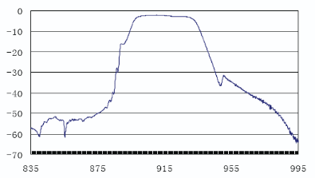

#### SMA cable phase stability measurement at 5.5 GHz

A cheap RG316 SMA cable was included in the through calibration, then it was bent at a sharp curve to observe phase change at high frequency.

Straight:

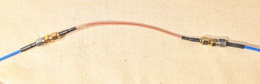

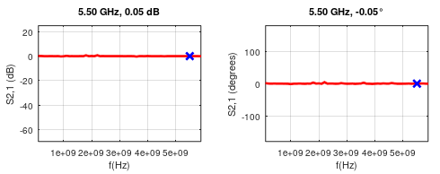

Bent:

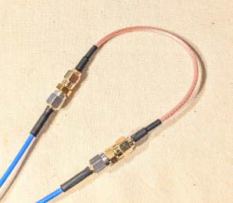

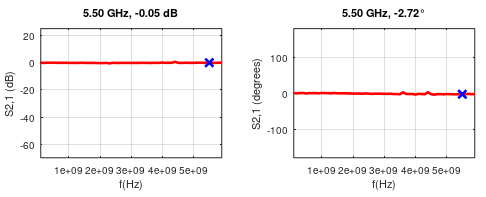

The difference between straight and bent states at 5.5 GHz is approximately -2.7°, meaning that the delay slightly decreases with bending, presumably because the center conductor is squished and therefore the RF path is shortened. After straightening the cable out, the phase shift returned to near its original value.

#### LNA gain compression measurement, power sweep

S2,1 power sweep of a [discrete BJT LNA](https://github.com/szoftveres/RF_microwave/tree/main/Amplifier/cascode) at 915 MHz, showing gain compression with increasing input power. The VNA can only provide about -5 dBm RF power at its maximum output setting, which is barely sufficient to overdrive the DUT LNA, hence a driver preamp was added, which brings up the maximum power level to about +5 dBm; this preamp as well as a 20 dB attenuator was included in the through calibration.

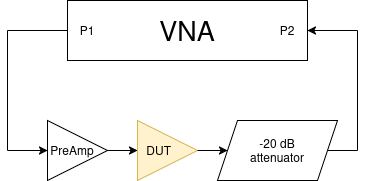

The DUT:

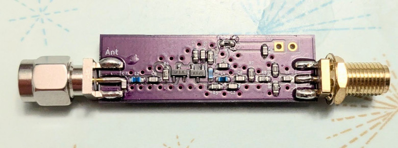

Power sweep:

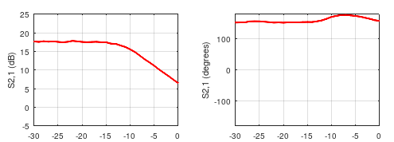

Linearity of the measurement system:

The driver preamp is capable of producing more than +10 dBm on its output before saturation, therefore it is able to operate in its linear region up to the maximum required +5 dBm level (it has 10 dB gain and the VNA can produce -5 dBm at most). The combined insertion loss of the DUT (LNA with 18 dB gain) and the 20 dB attenuator is -2 dB, which could theretically bring the VNA Port 2 receiver into compression by exposing it to +3 dBm power level (which is more than what it's designed for). However the DUT starts compressing approximately 10 dB below that point, therefore the power level at the VNA receiver never reaches more than approximately -5 dBm, which is within its linear region. The output of the LNA is tuned, meaning that higher order harmonic products that could also reach high levels (inherent result of overdriving the DUT) are naturally attenuated.

During power sweep the VNA reference path changes together with the measured path, so theoretically the VNA should stay in calibration even if it was calibrated only at a single power setting. This is not true however; the mixer as well as the amplifiers don't stay fully linear across their dynamic range, hence calibration for the full measurement range must be carried out for power sweeps as well.

#### Time-Domain Reflectometry

Frequency-domain linear sweep of reflection can be converted into time-domain reflection profile, by inverse Fourier-transform, as described [here](https://github.com/szoftveres/RF_Microwave/tree/main/tdr). The time-resolution is a function of the bandwidth (fmax - fmin) of the measurement, while the unambiguous range is determined by the number of measurement points. The result can be further turned into an impedance profile, by integrating the impedance changes along the X (time) axis. The resultig time-domain impedance profile is very useful for visualizing discontinuities along a transmission line. 

Measurement of a straight 2.5 mm copper tape mircostrip line, on a 1.2 mm thick FR4 substrate, terminated by two parallel 100 Ω SMD resistors:

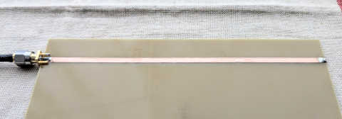

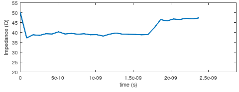

The same microstrip line, with its middle section widened to 6 mm:

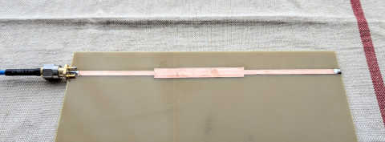

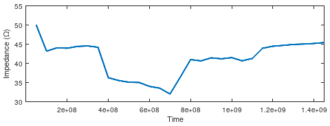

